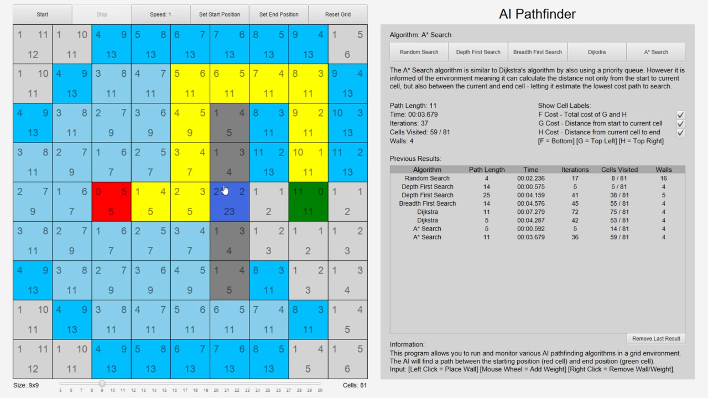

# AI Pathfinding Program

This program was created in JavaFX for my dissertation - “Exploring the Efficiency and Behaviour of Artificial Intelligence Pathfinding Algorithms in a 2D Environment”.

Pathfinding algorithms are widely used in applications for navigation such as video games, robotics and maps with the aim to reach an endpoint but perform and behave differently depending on the environment and their methods. 

This program allows a user to run depth-first search, breadth-first search, Dijkstra’s algorithm and A* in a controlled 2D grid environment. This investigation analyses and experiments with these pathfinding algorithms to provide an accurate and informative evaluation. It is designed to generate an understanding of the pathfinding algorithms by visualising the behaviour and monitoring the performance. The efficiency is monitored via the time taken, the returned path length and the number of iterations - all of which are recorded in a table.

Video Showcase: https://youtu.be/V8VhIa-0lII

